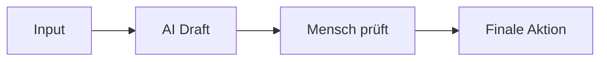

Eine Übersicht der wichtigsten Formatierungen und Tastenkombinationen für Obsidian.

---

### 🏗️ Text

### Überschriften

Verwende das `#`-Symbol gefolgt von einem Leerzeichen. Erlaubt sind 1 bis 6 Ebenen.

markdown

```
# Überschrift 1 (Haupttitel)
## Überschrift 2 (Sektion)
### Überschrift 3 (Untersektion)
#### Überschrift 4
##### Überschrift 5
###### Überschrift 6
```

Verwende Code mit Vorsicht.

### Trennlinien

Erzeugt eine horizontale Linie zur visuellen Trennung.

markdown

```
---
```

Verwende Code mit Vorsicht.

---

### ✍️ Text-Formatierung

| Stil                | Markdown-Code                        | Ergebnis      |
| ------------------- | ------------------------------------ | ------------- |
| **Fett**            | `**Dein Text**` oder `__Dein Text__` | **Dein Text** |
| _Kursiv_            | `*Dein Text*` oder `_Dein Text_`     | _Dein Text_   |
| ~~Durchgestrichen~~ | `~~Dein Text~~`                      | ~~Dein Text~~ |
| ==Markiert==        | `==Dein Text==`                      | ==Dein Text== |

---

### 💻 Code & Diagramme

### Inline-Code

Für kurze Code-Fragmente mitten im Text.

- **Code:** `dein_befehl`
- **Ergebnis:** `dein_befehl`

### Code-Blöcke

Für mehrzeiligen Programmiercode oder Skripte. Verwende drei Backticks am Anfang und Ende.

text

````
```python
print("Hallo Welt")
```
````

Verwende Code mit Vorsicht.

### Mermaid Diagramme (z.B. Workflows)

Verwende drei Backticks mit dem Zusatz `mermaid`, um logische Abläufe zu zeichnen.

text

````

````

Verwende Code mit Vorsicht.

---

### 📋 Listen & Checklisten

### Aufzählungen & Nummerierungen

markdown

```
- Punkt 1
- Punkt 2
  - Eingerückter Punkt

1. Erster Schritt
2. Zweiter Schritt
```

Verwende Code mit Vorsicht.

### Checklisten (To-Dos)

Verwende ein großes `X` in den Klammern, um eine Aufgabe als erledigt zu markieren.

markdown

```
- [ ] Offene Aufgabe
- [x] Erledigte Aufgabe
```

Verwende Code mit Vorsicht.

---

### 🔗 Links & Verknüpfungen

### Interner Obsidian-Link (Wiki-Link)

Verknüpft eine andere Notiz in deinem Tresor (Vault).

markdown

```
[[Name der anderen Notiz]]
[[Name der Notiz|Alternativer Text, der angezeigt wird]]
```

Verwende Code mit Vorsicht.

### Externer Web-Link

Verlinkt auf eine Website im Internet.

markdown

```
[Anzeigetext](https://beispiel.de)
```

Verwende Code mit Vorsicht.

---

### ⌨️ Die wichtigsten Obsidian Hotkeys (Tastenkombinationen)

- **`Strg` + `E`** (Mac: `Cmd` + `E`) ➔ Wechseln zwischen **Editor** und **Lese-Ansicht** (Vorschau)
- **`Strg` + `K`** (Mac: `Cmd` + `K`) ➔ Link einfügen
- **`Strg` + `P`** (Mac: `Cmd` + `P`) ➔ Befehlspalette öffnen (sucht nach allen Obsidian-Funktionen)
- **`Strg` + `O`** (Mac: `Cmd` + `O`) ➔ Schnellöffner (sucht nach anderen Notizen)

---
#### Ausklapen

```
> [!code]- Anweisungen DE (Klicke zum Ausklappen)
> ```kopieren

Ctrl + P --> Callout 

> ```
```

=
> [!code]- Anweisungen DE (Klicke zum Ausklappen)
> ```kopieren
> Hier dein text
> Ausgeklappt
> ```
